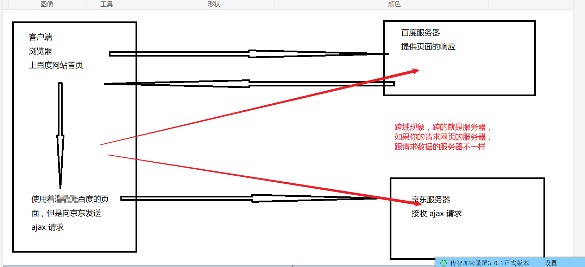
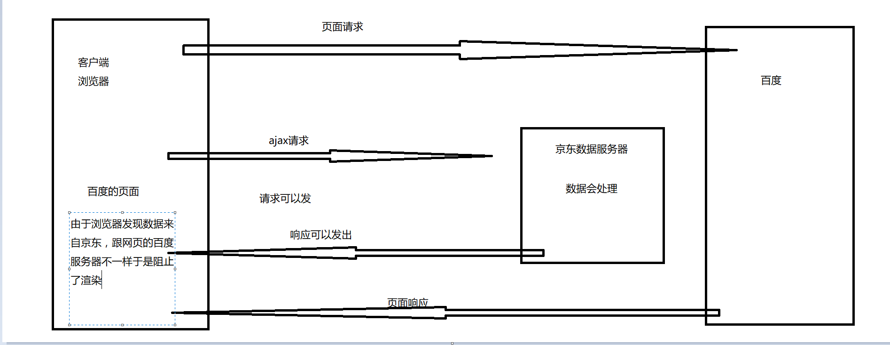
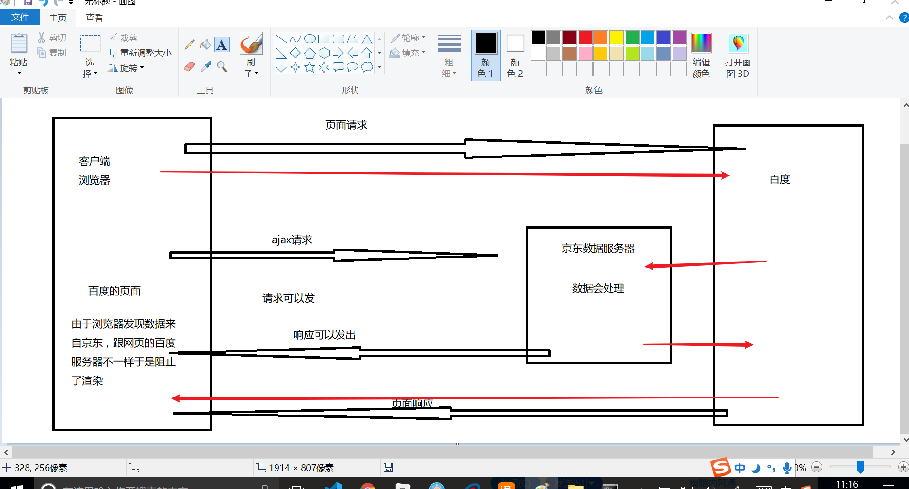
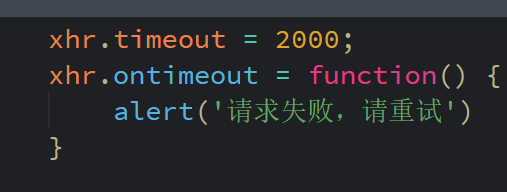
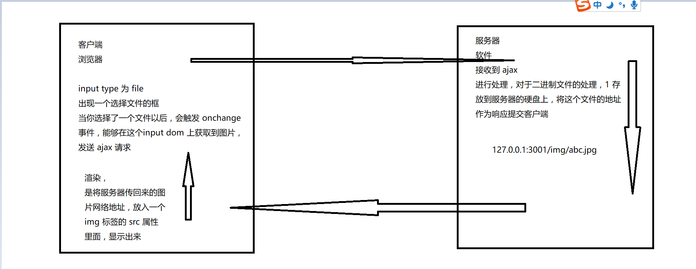
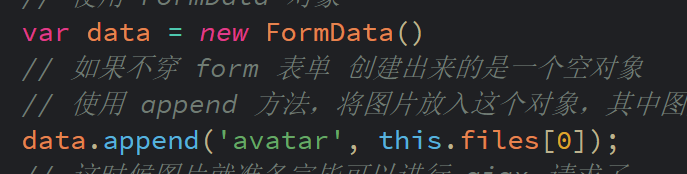
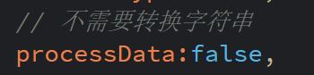
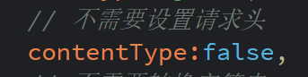

# 笔记


# Ajax 进阶


## XMLHttpRequest 2.0 （2008）

现在主流的 XMLHttpRequest 标准是 XMLHttpRequest 2，2008 年制定的。

在 2008 年前的浏览器就不支持 XMLHttpRequest 2 新特性。（IE8不支持 xhr2 后添加的新功能）。

- 可以请求不同域名下的数据（跨域请求，前提是服务器配合编程）。
- 可以设置HTTP请求的请求超时时限。timeout / ontimeout
- 可以使用FormData对象管理表单数据。FormData对象特点是吧整个表单数据转换为二进制
  - 这个FormData 必须配合 原生js dom form对象使用
- 可以上传文件。
- 可以获得数据传输的进度信息。onprogress 里面有一个 已经加载 loaded / 全部总量 total

### 复习 XMLHttpRequest 的使用

```js
		var xhr = new XMLHttpRequest();
        
        xhr.open('get', 'http://127.0.0.1:3001/getUserNameAjax');
       
        xhr.onreadystatechange = function() {
            if (xhr.status == 200 && xhr.readyState == 4) {
                var res = JSON.parse(xhr.responseText);
                console.log(res);
                var dom = document.querySelector('#greeting');
                dom.innerHTML = res.data.name + "欢迎回来";
                // $('#greeting').html(res.data.name + "欢迎回来")
            }
        }

        xhr.send()
```


### 跨域

- 定义

  html 页面文件，和 ajax 获取的数据，来自两个不同的服务器，就叫做跨域，其实就是横跨了服务器

  

- 问题造成的原因原因

  浏览器认为，哪里请求的页面，就应该哪里请求数据，到一个不同的服务器请求数据，会有危险，于是浏览器会阻止渲染页面（请求能发，能处理，能响应，但是一到浏览器，发现当前页面和数据来自不同服务器，就会阻止渲染）

  

  

- 影响范围

  ajax 请求数据会受到影响，但是 html 代码中，二次请求文件，比如图片 img src, 或者 script src 这些不会受到限制

  

- 造成问题

  一家公司有自己的服务器，通常来说存放网页的服务器，也响应数据请求，一般来说问题不大。但是有一些特殊的数据，是非得要到别的服务器拿的，这个时候，浏览器这种默认的安全策略反而会阻碍我们的编程

  

- 解决方案

  - CROS 数据服务器添加响应头 Access-Control-Allow-Origin: *

  - Proxy 代理，网页服务器，同时负责转发不同服务器的数据

    只从网页服务器请求数据，那么网页和数据来自同一服务器，就不是跨域了

    

  - jsonp 利用 script 标签不受跨域限制的特性，使用 script 标签向数据服务器请求一个 js文件

    数据服务器会将数据动态生成一个 js 文件响应

小结：

- http协议、ip、端口，完全一样才是同一台服务器软件，其中有一个不同，就是不同服务器，就会有跨域现象
- 跨域是浏览器 的同源安全策略造成的，造成的结果是，请求-处理-响应 都没问题，到了 渲染 这里被卡住。
- 有时候，非得要使用不同服务器的数据，比如天气信息汇率，余额之类，所以要绕过跨域限制，解决跨域问题

- 跨域问题的解决，需要修改服务器，前后端配合，前端没法单独处理，所以学到 node 的时候会更详细地讲解决方案

### Timeout

类似于 jQuery ajax 的 timeout

### ontimeout

类似于 jQuery ajax 的 error，是一个事件，一旦超时就会触发，应该赋值一个函数，用来提醒用户请求超时



### FormData 二进制方式传输数据

FormData 是 XMLHttpRequest 2.0 增加的一个对象，作用是以二进制模式存放表单数据

#### 数据传输方法

```javascript
// 字符串
var dataStr = 'userName=' + userNameInput.value + '&userPwd=' + userPwdInput.value;

// 对象
var dataObj = {
	userName: userNameInput.value,
	userPwd: userPwdInput.value
}
// 二进制
var formDom = document.querySelector('#form')
var data = new FormData(formDom);
```

#### FormData 使用方式

- 通过传入一个 form 标签的 dom 对象，可以将这个 form 的所有数据转换成二进制

- 这个二进制对象可以直接作为 data 发送 ajax post 请求

- 可以使用 FormData 对象的 append 方法 继续追加数据，如

  formData.append('userPhone', '13111111111')


#### 注意事项小结

- 如果要转换一个 form 为必须是原生 dom 的form 标签

- 不要设置请求头

  因为二进制对象不需要 urlencoded 进行编码所以不需要设置请求头，请求头由浏览器自动设置。

  contentType: false

- 不需要将对象转换为字符串了，会将数据转换为转换成二进制

  processData: false

- 只能带在请求体上，发送 post 请求


## FormData对象最重要的用途：上传文件

虽然可以将表单输入的用户名，密码等数据转换为二进制，再发起 ajax 请求，

但其实一般比较少这么做，FormData 这个二进制数据对象最重要的功能是上传文件。

图片、音乐等文件以二进制的形式上传

### 图片上传具体步骤（图）

- 注册 onchange 事件

- 准备图片数据 使用 FormData 对象的 append 方法

- 使用 ajax 上传

  


### 目标

点击按钮选择图片，提交 ajax 请求上传到服务器，成功以后获取响应的图片地址，显示在网页上

### 技术细节

- 使用 console.dir(dom) 可以查看得到 input file 标签的属性

- input file 对象的 onchange 事件里面，可以用 this.files 获取已选择文件数组，只有一张图片就是 this.files[0]

- 上传文件的 input 标签默认只能选择一个文件，如果要选择多个则需要  multiple

- 使用 FormData 对象的一个方法 append 可以往 FormData 对象放入文件，

  用法是 formData.append(key, file)，其中 key 是后台文档规定的字段名，

  file 是 input file dom 的 onchange 事件时获取的 this.files[0] 文件，

  如果有多张图片，可以根据后台需求的不同字段名，多次 append 不同图片。

### 原生上传图片实例

- 注册 onchange 事件
- 准备图片数据 使用 FormData 对象的 append 方法
- 使用 ajax 上传

```js
var data = new FormData()
            // 如果不穿 form 表单 创建出来的是一个空对象
            // 使用 append 方法，将图片放入这个对象，其中图片的字段名需要参考文档
            data.append('avatar', this.files[0]);

var xhr = new XMLHttpRequest();
            xhr.open('post','http://127.0.0.1:3001/uploadFile');
            // 上传二进制文件不需要手动设置请求头
            xhr.onreadystatechange = function() {
                if (xhr.status == 200 && xhr.readyState == 4) {
                    var res = JSON.parse(xhr.responseText);
                    console.log(res);
                    // 渲染，将响应的图片地址，放入 img 标签，显示出来
                    var imgDom = document.querySelector('#img');
                    imgDom.src = res.src;
                }
            }
            xhr.send(data)
```


### jQuery 上传图片实例

- 注册 change 事件
- 准备图片数据 使用 FormData 对象的 append 方法
- 使用 $.ajax() 上传

### jQuery 上传图片注意事项

我们封装的时候知道，适配 post 请求的时候，我们判断到 post 请求会自动设置请求头，而在传输对象数据时，我们会自动将数据转换为字符串。

本来一切正常，但是偏偏在上传二进制文件的时候出现了问题，

- 二进制文件传输，不需要手动设置请求头
- 二进制文件也不应该转换为字符串

**解决办法：**

jQuery ajax 的两个参数

```javascript
$.ajax({
    contentType:false,
    processData:false
})
```

#### 小结

因为二进制数据，不需要转换为字符串，也不需要请求头

今天新学的 jQuery ajax 参数有两个，专门针对上传图片使用

- contentType , 设置成 false 可以阻止 自动设置请求头
- processData  设置成 false, 可以阻止 自动转换数据为字符串

上传图片的步骤：

- 注册 onchange 事件

- 获取图片二进制数据 放入  FormData 对象，注意文档指定的属性名

  ```javascript
  var data = new FormData();
  data.append('avatar', this.files[0]);
  ```

- ajax 发送请求

上传图片的 ajax 基本跟其他 ajax 请求一样，只有三点区别：

- 区别1 要转换 图片数据为符合后台要求的，带字段名的二进制对象

  

- 区别2 禁止数据自动转换为字符串

  

- 区别3 禁止自动设置请求头

  

### 上传其他文件

音乐、视频等等其实也是一样

只不过没有 img 标签预览的形式

- 注册 change 事件
- 获取文件二进制数据 var data = new FormData() ; FormData.appand ('key', this.files[0])
- ajax 传输文件

### 原生 XMLHttpRequest 实现上传进度条 - 了解

xhr.onprogress / xhr.upload.onprogress 分别是下载和上传的进度变化事件

上传数据时，数据传输完成度变更，会触发事件 xhr.upload.onprogress

实现：

```javascript
xhr.upload.onprogress = function(event) {
//一个数字代表已经上传的数据量 event.loaded
//一个数字代表总数据量 event.total
// 计算百分比即可 var percent = Math.floor((event.loaded / event.total)*100) + "%"
// 接下来渲染在页面即可
    var domPercent = document.querySelector('#percent');
    domPercent.innerHTML = percent;
   	console.log(percent);
}
```

# 


